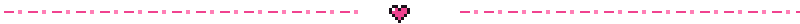
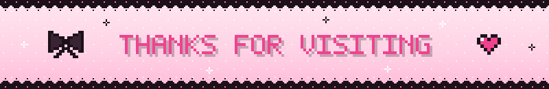

<div align="center">




<br>

[](https://monicadfm.github.io/Portfolio)
[](https://www.linkedin.com/in/monica-moura-dev/)

</div>



```bash
monica@dev:~$ cat About.cs
```

```csharp
public class Monica : Developer
{
    public string   Role        => "Backend Developer";
    public string   Location    => "Portugal";
    public string   Education   => "CET Level 5, IT Systems & Programming @ CINEL";

    public string[] Backend     => ["C#", "ASP.NET Core Web API", "REST", "SQL Server"];
    public string[] Frontend    => ["HTML", "CSS", "JavaScript", ".NET MAUI"];
    public string[] Planning    => ["UML", "Use-case", "Class & ER diagrams"];

    public string[] Languages   => ["Portuguese (native)", "English (C2)", "Spanish (A2)"];
    public string   Experience  => "Customer-facing roles in Portugal & Stockholm, Sweden";
    public string   Building    => "WishBound mobile app (.NET MAUI)";

    public bool     OpenToInternships => true;
}
```

> **I build both sides of the app:** the REST API and database underneath, and the interface people click on.
> Currently looking for an **internship in backend / software development**.


```bash
monica@dev:~$ ls ./projects
```

- **[WishBound](https://monicadfm.github.io/Portfolio)**: *final course project, in development*<br>
  A web + mobile platform for collecting virtual characters: gacha-style pulls with rarities and a pity system, limited-time banners, friendship levels with characters, daily rewards and a full admin dashboard with audit logging.<br>
  <sub>`ASP.NET Core Web API` · `C#` · `SQL Server` · `HTML/CSS/JS` · `.NET MAUI` · `Git`</sub>

- **[Portfolio](https://github.com/monicadfm/Portfolio)**: *personal site*<br>
  Built from scratch with HTML, CSS and vanilla JavaScript: a frontend/backend slider that shows my profile as a UI card or as a JSON API response, a WishBound banner simulator with weighted pulls and pity, live GitHub API data, light/dark mode and accessibility support.<br>
  <sub>`HTML` · `CSS` · `JavaScript` · `GitHub API`</sub>

  <a href="https://monicadfm.github.io/Portfolio/"></a>

- **[Side-Scroller Survival Game](https://github.com/monicadfm/Sidescroller-Game-Code)**: *academic project*<br>
  A 2D survival shooter built from scratch with vanilla JavaScript and the HTML5 Canvas, no game engine: waves of five slime types, a five-layer parallax world, dashing, shooting with a cooldown, health and live score.<br>
  <sub>`JavaScript` · `HTML5 Canvas` · `CSS`</sub>

  <a href="https://monicadfm.github.io/Sidescroller-Game-Code/Menu/index.html"></a><br>
  <sub><kbd>A</kbd> <kbd>D</kbd> move · <kbd>W</kbd> jump · <kbd>Space</kbd> dash · <kbd>U</kbd> shoot</sub>

- **[Pixel-art Profile Banner](https://github.com/monicadfm/monicadfm/tree/main/tools)**: *this page's header*<br>
  An animated SVG banner generated with a Python script: custom pixel font, SMIL animations, fireworks drawn with trigonometry.<br>
  <sub>`Python` · `SVG`</sub>

- **Discord Bot**: a Python bot for a Discord server<br>
  <sub>`Python`</sub>

- **Mini games**: Snake, Rock Paper Scissors and Dice Roll, where I practised the fundamentals<br>
  <sub>`Python` · `JavaScript`</sub>


### 🖤 Tech Stack

<div align="center">

<br>


<sub><b>Also:</b> ASP.NET Core Web API · REST · SQL Server · .NET MAUI · UML</sub>

</div>


### 💗 Stats

<div align="center">


</div>

<div align="center">

</div>


### 🖤 Contribution

<div align="center">
<picture>
  <source media="(prefers-color-scheme: dark)" srcset="https://raw.githubusercontent.com/monicadfm/monicadfm/output/github-contribution-grid-snake-dark.svg" />
  <source media="(prefers-color-scheme: light)" srcset="https://raw.githubusercontent.com/monicadfm/monicadfm/output/github-contribution-grid-snake.svg" />
  
</picture>
</div>


### 💗 Get in Touch

<div align="center">

[](mailto:miamonicamoura@gmail.com)
[](https://www.linkedin.com/in/monica-moura-dev/)
[](https://github.com/monicadfm)



</div>
